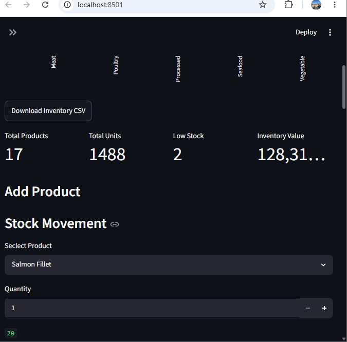
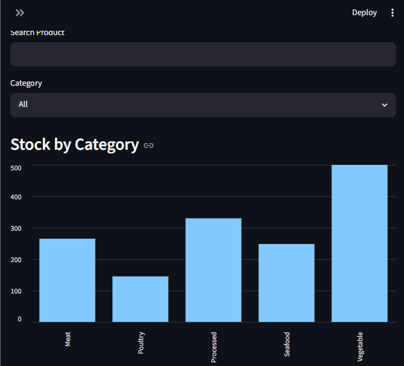
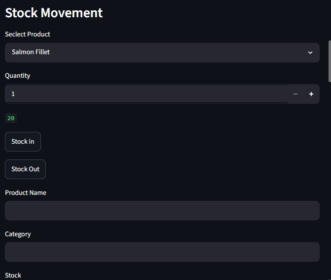
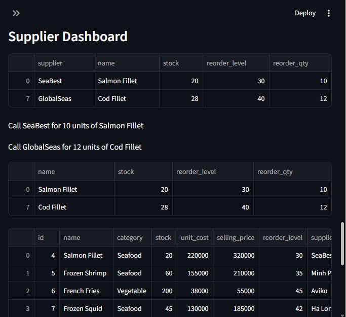

\# Inventory Automation System


A Streamlit-based inventory management and warehouse automation dashboard.


\## Features

\- Product CRUD (Create, Read, Update, Delete)

\- Stock In / Stock Out

\- Stock Movement History

\- Low Stock Alerts

\- Supplier Dashboard

\- KPI Dashboard

\- Search \& Filter

\- Inventory Analytics Charts


\## Tech Stack

\- Python

\- Streamlit

\- SQLite

\- Pandas


## Screenshots

### Dashboard


### Inventory


### Stock Movement


### Supplier Dashboard



\## Run Locally

```bash

pip install -r requirements.txt

streamlit run app.py

```

